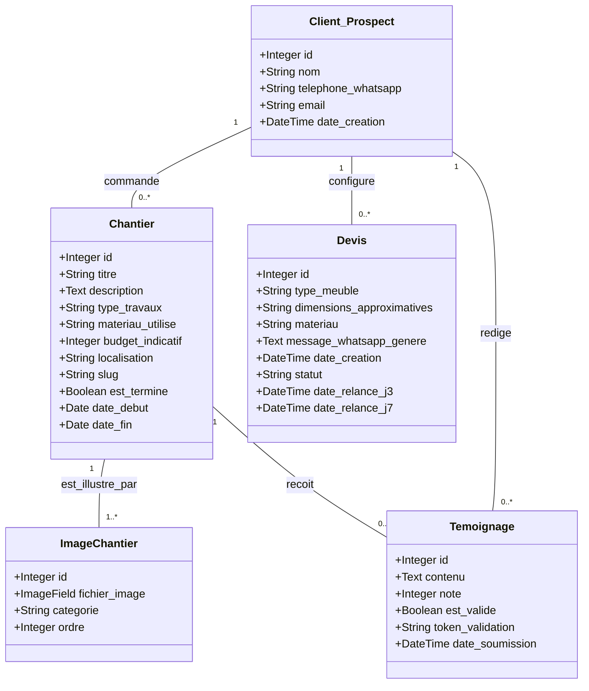

# 🪵 MenuisierPro — Site web dynamique pour artisan menuisier

Projet full-stack Django développé dans le cadre d'un cursus en développement web, pour un artisan menuisier/charpentier basé à Madagascar.

---

## 📌 Contexte

Ce projet répond à un double objectif :

- **Scolaire** : valider les compétences back-end (Auth, CRUD, API REST, modèles relationnels, déploiement)
- **Professionnel** : livrer un outil réellement utilisable par l'artisan, sans compétences techniques de sa part

Le site s'adapte aux contraintes locales : réseau 3G, usage dominant de WhatsApp et Facebook, clientèle mixte (particuliers malgaches, expatriés, entreprises).

---

## ✨ Fonctionnalités

### Axe scolaire
| Fonctionnalité | Description |
|---|---|
| **Vitrine de crédibilité** | Portfolio de chantiers avec photos avant/après et témoignages clients |
| **Générateur de devis WhatsApp** | Formulaire de configuration qui produit un message WhatsApp pré-rempli |
| **Machine à témoignages** | Envoi automatique d'un lien de collecte d'avis après chaque chantier |

### Axe professionnel
| Fonctionnalité | Description |
|---|---|
| **Page chantier partageable** | URL unique par chantier, optimisée 3G, partageable en un clic sur WhatsApp/Facebook |
| **Relanceur automatique** | Relance automatique du prospect à J+3 et J+7 si pas de réponse au devis |

---

## Modèle de données



### Valeurs métier

**`ImageChantier.categorie`** : `avant` · `pendant` · `apres`

**`Devis.statut`** : `en_attente` · `relance_j3` · `relance_j7` · `converti` · `abandonne`

---

## Stack technique

| Composant | Technologie |
|---|---|
| Framework | Django (Python) |
| Base de données | PostgreSQL |
| Front-end | Templates Django + CSS |
| Stockage images | À définir selon l'hébergeur (local / S3) |
| Déploiement | À définir (Railway / Render / VPS) |

---

## Plan de développement

| Sprint | Semaines | Fonctionnalité | Priorité |
|---|---|---|---|
| 1 | 1–2 | Auth + CRUD portfolio + upload images | Scolaire |
| 2 | 3–4 | Générateur de devis WhatsApp | Scolaire |
| 3 | 5–6 | Machine à témoignages automatique | Scolaire |
| 4 | 7 | Page chantier partageable (ergonomie prioritaire) | Professionnel |
| 5 | 8 | Relanceur automatique + déploiement | Professionnel |

---

## Points de vigilance

- **Images** : upload et optimisation pour la 3G malgache — anticiper dès le sprint 1
- **Page chantier** : l'interface de création doit être aussi simple que poster une photo sur Facebook — c'est la contrainte de design principale du sprint 4
- **Relanceur** : vérifier la disponibilité de WhatsApp Business API à Madagascar avant de démarrer le sprint 5

---

## Installation (à compléter)

```bash
git clone https://github.com/ton-repo/menuisierpro.git
cd menuisierpro
python -m venv env
source env/bin/activate
pip install -r requirements.txt
cp .env.example .env
python manage.py migrate
python manage.py runserver
```

---

## Équipe

Projet réalisé par Arnaud Messenet, Thomas Haenel et Jason Jean Louis — 2 mois
