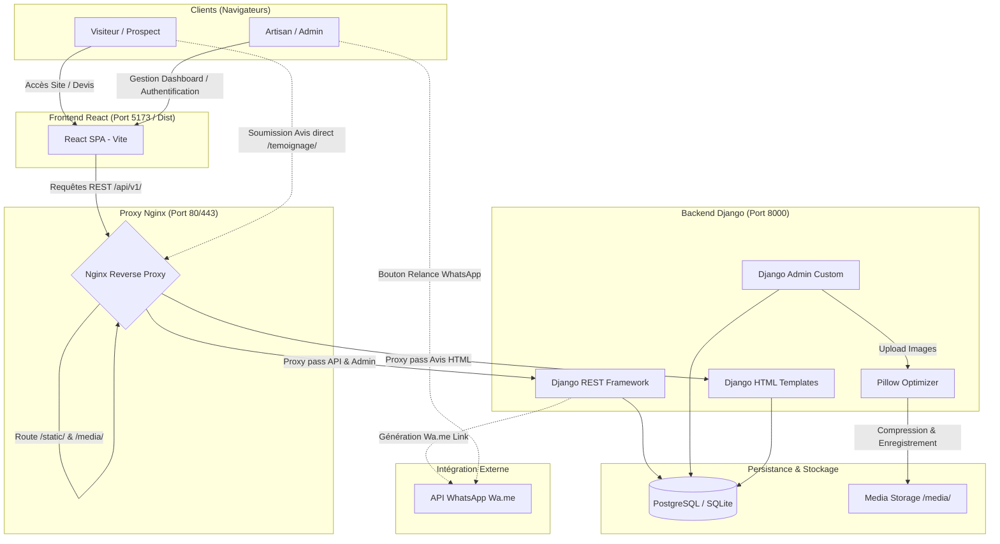
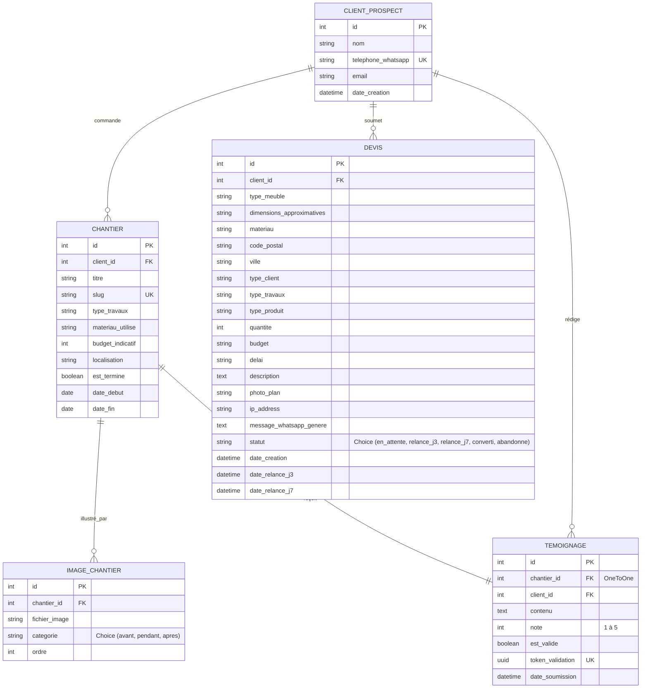
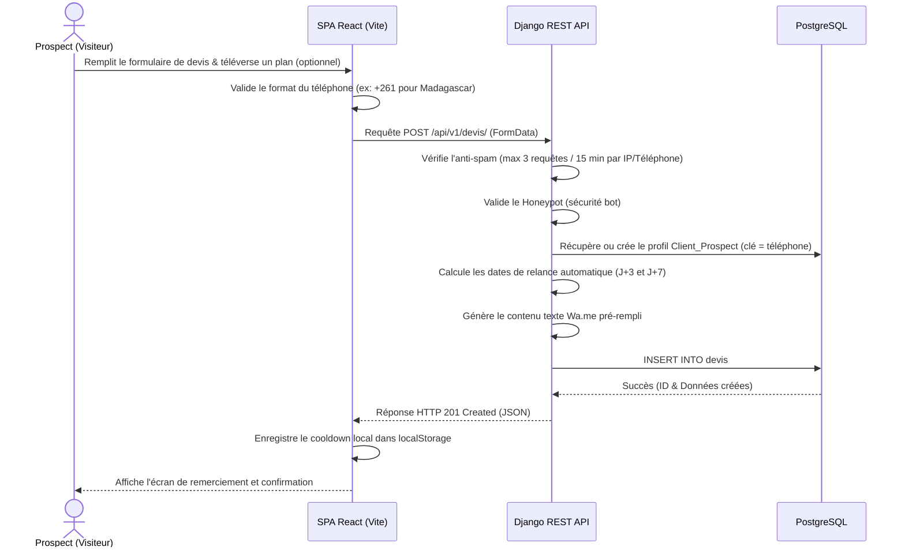
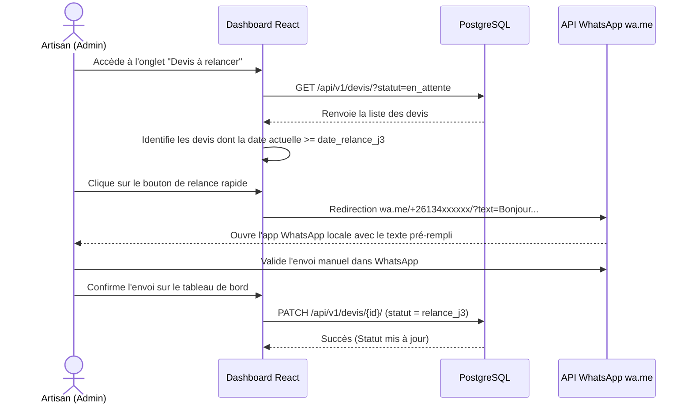

# 🪵 GEPETTO'S HOUSE — Site Web Dynamique & Espace Gestion pour Artisan Menuisier

Projet full-stack découplé (React / Django REST Framework) développé pour un artisan menuisier-charpentier basé à Madagascar. Ce projet répond à des contraintes locales fortes (réseau mobile 3G/4G instable, coûts de data, usage prédominant de WhatsApp) tout en offrant une interface d'administration premium et sécurisée pour la gestion des chantiers et prospects.

---

## 🛠️ 1. Architecture Système & Flux de Données

Le projet adopte une architecture découplée moderne et performante, optimisée pour le bas débit et la robustesse en production.


```mermaid
graph TB
    subgraph "Clients (Navigateurs)"
        Client[Visiteur / Prospect]
        Artisan[Artisan / Admin]
    end

    subgraph "Proxy Nginx (Port 80/443)"
        Nginx{Nginx Reverse Proxy}
    end

    subgraph "Backend Django (Port 8000)"
        DRF[Django REST Framework]
        DjangoAdmin[Django Admin Custom]
        Pillow[Pillow Optimizer]
        Templates[Django HTML Templates]
    end

    subgraph "Frontend React (Port 5173 / Dist)"
        Vite[React SPA - Vite]
    end

    subgraph "Persistance & Stockage"
        DB[(PostgreSQL / SQLite)]
        Media[Media Storage /media/]
    end

    subgraph "Intégration Externe"
        WA[API WhatsApp Wa.me]
    end

    %% Routing
    Client -->|Accès Site / Devis| Vite
    Artisan -->|Gestion Dashboard / Authentification| Vite
    Vite -->|Requêtes REST /api/v1/| Nginx
    Client -.->|Soumission Avis direct /temoignage/| Nginx
    
    Nginx -->|Route /static/ & /media/| Nginx
    Nginx -->|Proxy pass API & Admin| DRF
    Nginx -->|Proxy pass Avis HTML| Templates
    
    %% Backend internal
    DRF --> DB
    DjangoAdmin --> DB
    Templates --> DB
    
    %% Media handling
    DjangoAdmin -->|Upload Images| Pillow
    Pillow -->|Compression & Enregistrement| Media
    
    %% External
    DRF -.->|Génération Wa.me Link| WA
    Artisan -.->|Bouton Relance WhatsApp| WA
```

### Composants techniques :
- **Frontend SPA** : Développé en **React 19** avec **Vite**, **SASS** pour le design système, et **Lucide Icons** pour la clarté visuelle. Communique exclusivement via l'API REST sécurisée.
- **Backend API REST** : Alimenté par **Django** et **Django REST Framework (DRF)**. Il gère l'authentification (Token-based), l'anti-spam par IP, et les routes CRUD des ressources.
- **Formulaire de collecte d'avis (Django Templates)** : Pour alléger au maximum la charge réseau des clients sur smartphone, la saisie des témoignages se fait sur des pages HTML5 traditionnelles épurées, servies directement par Django (Django Templates + CSS natif) via des jetons sécurisés (Tokens) à usage unique.
- **Reverse Proxy & Serveur Web** : **Nginx** gère la redirection SSL, sert directement le dossier de médias `/media/` et les fichiers statiques de l'admin `/static/`, et relaie l'API au serveur d'application **Gunicorn (WSGI)**.
- **Base de Données** : **PostgreSQL** pour la production (garantissant la fiabilité des relations), et **SQLite** en option locale pour simplifier le développement initial.
- **Optimisation d'Images** : La bibliothèque **Pillow** intercepte les téléversements de photos par l'artisan, les redimensionne à un maximum de 1200x1200px et applique une compression JPEG à 70%. Cela réduit le poids moyen des fichiers de 5 Mo à moins de 300 Ko pour préserver le forfait data 3G/4G des visiteurs malgaches.

---

## 📋 2. Fonctionnalités & Spécifications Métier (MoSCoW)

L'application a été conçue et priorisée pour offrir une valeur métier immédiate à l'artisan sans ajouter de complexité inutile.

### 📌 Must Have (Indispensable)
- **Générateur de devis WhatsApp** : Formulaire interactif en plusieurs étapes permettant au prospect de configurer sa demande de mobilier (type, dimensions, essence de bois, budget, plan/photo).
- **Console d'Administration Sécurisée** : Espace réservé à l'artisan pour visualiser les devis reçus, suivre le statut des clients, et modérer les avis.
- **Intégration Click-to-Chat WhatsApp** : Bouton sur chaque carte devis permettant à l'artisan de démarrer immédiatement une conversation WhatsApp avec le client sans ajouter manuellement le numéro à ses contacts.

### 📌 Should Have (Important)
- **Portfolio Dynamique & Lightbox** : Galerie photo fluide présentant les chantiers réalisés (filtrable par matériau et type de travaux) avec un affichage grand écran des photos avant/après.
- **Carrousels animés (Marquee)** : Défilement fluide horizontal automatique des réalisations et des retours clients sur la page d'accueil pour donner une impression de dynamisme.

### 📌 Could Have (Optionnel)
- **Collecte automatique de témoignages** : Système générant un lien à usage unique envoyé par l'artisan à son client à la fin d'un chantier. Ce lien permet de récolter une note et un texte de satisfaction.

### 📌 Won't Have (Exclu de la V1)
- **Paiement en ligne** : Non implémenté en raison des contraintes techniques et réglementaires sur les passerelles de paiement à Madagascar.

---

## 🗂️ 3. Modèle de Données (Base de Données)

Le schéma relationnel ci-dessous détaille la structure des tables PostgreSQL implémentées dans l'application.


```mermaid
erDiagram
    CLIENT_PROSPECT {
        int id PK
        string nom
        string telephone_whatsapp UK
        string email
        datetime date_creation
    }
    
    CHANTIER {
        int id PK
        int client_id FK
        string titre
        string slug UK
        string type_travaux
        string materiau_utilise
        int budget_indicatif
        string localisation
        boolean est_termine
        date date_debut
        date date_fin
    }
    
    IMAGE_CHANTIER {
        int id PK
        int chantier_id FK
        string fichier_image
        string categorie "Choice (avant, pendant, apres)"
        int ordre
    }
    
    TEMOIGNAGE {
        int id PK
        int chantier_id FK "OneToOne"
        int client_id FK
        text contenu
        int note "1 à 5"
        boolean est_valide
        uuid token_validation UK
        datetime date_soumission
    }
    
    DEVIS {
        int id PK
        int client_id FK
        string type_meuble
        string dimensions_approximatives
        string materiau
        string code_postal
        string ville
        string type_client
        string type_travaux
        string type_produit
        int quantite
        string budget
        string delai
        text description
        string photo_plan
        string ip_address
        text message_whatsapp_genere
        string statut "Choice (en_attente, relance_j3, relance_j7, converti, abandonne)"
        datetime date_creation
        datetime date_relance_j3
        datetime date_relance_j7
    }

    CLIENT_PROSPECT ||--o{ CHANTIER : "commande"
    CLIENT_PROSPECT ||--o{ DEVIS : "soumet"
    CLIENT_PROSPECT ||--o{ TEMOIGNAGE : "rédige"
    CHANTIER ||--o{ IMAGE_CHANTIER : "illustré_par"
    CHANTIER ||--|| TEMOIGNAGE : "reçoit"
```

### Règles de transition des statuts de Devis :
- **`en_attente`** : Statut initial lors de la soumission par le prospect.
- **`relance_j3` / `relance_j7`** : Indique que l'artisan a envoyé la relance à J+3 ou J+7.
- **`converti`** : Quand le devis débouche sur la création d'un chantier.
- **`abandonne`** : En cas de refus ou d'absence de réponse après J+7.

---

## 🔄 4. Flux Clés & Diagrammes de Séquence

### A. Soumission d'une demande de devis (Visiteur public)

Le formulaire public transmet les données au backend en gérant l'anti-spam IP et le hachage des métadonnées.


```mermaid
sequenceDiagram
    actor Visiteur as Prospect (Visiteur)
    participant Front as SPA React (Vite)
    participant Back as Django REST API
    participant DB as PostgreSQL

    Visiteur->>Front: Remplit le formulaire de devis & téléverse un plan (optionnel)
    Front->>Front: Valide le format du téléphone (ex: +261 pour Madagascar)
    Front->>Back: Requête POST /api/v1/devis/ (FormData)
    Back->>Back: Vérifie l'anti-spam (max 3 requêtes / 15 min par IP/Téléphone)
    Back->>Back: Valide le Honeypot (sécurité bot)
    Back->>DB: Récupère ou crée le profil Client_Prospect (clé = téléphone)
    Back->>Back: Calcule les dates de relance automatique (J+3 et J+7)
    Back->>Back: Génère le contenu texte Wa.me pré-rempli
    Back->>DB: INSERT INTO devis
    DB-->>Back: Succès (ID & Données créées)
    Back-->>Front: Réponse HTTP 201 Created (JSON)
    Front->>Front: Enregistre le cooldown local dans localStorage
    Front-->>Visiteur: Affiche l'écran de remerciement et confirmation
```

### B. Relance de devis assistée (Espace Artisan)

Pour éviter les frais d'API professionnelles (Meta Business API) inadaptés pour un petit artisan, le système utilise un protocole **hybride assisté**.


```mermaid
sequenceDiagram
    actor Artisan as Artisan (Admin)
    participant Dash as Dashboard React
    participant DB as PostgreSQL
    participant WA as API WhatsApp wa.me

    Artisan->>Dash: Accède à l'onglet "Devis à relancer"
    Dash->>DB: GET /api/v1/devis/?statut=en_attente
    DB-->>Dash: Renvoie la liste des devis
    Dash->>Dash: Identifie les devis dont la date actuelle >= date_relance_j3
    Artisan->>Dash: Clique sur le bouton de relance rapide
    Dash->>WA: Redirection wa.me/+26134xxxxxx/?text=Bonjour...
    WA-->>Artisan: Ouvre l'app WhatsApp locale avec le texte pré-rempli
    Artisan->>WA: Valide l'envoi manuel dans WhatsApp
    Artisan->>Dash: Confirme l'envoi sur le tableau de bord
    Dash->>DB: PATCH /api/v1/devis/{id}/ (statut = relance_j3)
    DB-->>Dash: Succès (Statut mis à jour)
```

---

## 🔌 5. Spécifications des APIs

### API Externe (WhatsApp click-to-chat)
- **Base URL** : `https://wa.me/{telephone}`
- **Paramètres** : `?text={url_encoded_message}`
- **Usage** : Permet d'ouvrir une fenêtre de discussion pré-remplie avec le prospect.

### APIs Internes (REST)

Toutes les routes internes sont préfixées par `/api/v1/`.

| Méthode | Endpoint | Authentification | Description |
|---|---|---|---|
| `POST` | `/auth/` | Non | Échange identifiants contre Token DRF |
| `GET` | `/chantiers/` | Non | Récupère la liste des chantiers validés |
| `POST` | `/devis/` | Non | Soumet un formulaire de devis (Honeypot + Rate Limit) |
| `GET` | `/devis/` | Token requis | Récupère tous les devis (filtrable par statut/materiau) |
| `DELETE`| `/devis/{id}/` | Token requis | Supprime définitivement un devis |
| `GET` | `/dashboard/stats/` | Token requis | Retourne les indicateurs de performances généraux |

#### Exemple : Soumission d'un Devis (`POST /api/v1/devis/`)
**Requête (Multipart/FormData) :**
- `nom` : `"Jean Rakoto"`
- `telephone_whatsapp` : `"+261340001234"`
- `email` : `"jean.rakoto@gmail.com"` (facultatif)
- `code_postal` : `"101"`
- `ville` : `"Antananarivo"`
- `type_client` : `"Particulier"`
- `type_travaux` : `"Rénovation (remplacement)"`
- `type_produit` : `"Menuiserie intérieure (Escalier, Dressing, Portes)"`
- `type_meuble` : `"Menuiserie intérieure (Escalier, Dressing, Portes)"`
- `dimensions_approximatives` : `"200x80x10cm"`
- `quantite` : `1`
- `materiau` : `"Palissandre"`
- `description` : `"Besoin d'une porte intérieure en bois dur."`
- `delai` : `"Sous 3 mois"`
- `budget` : `"Entre 2 000 € et 5 000 €"`
- `photo_plan` : `[Fichier Image]`
- `site_web` : `""` (Champ invisible anti-spam, doit impérativement rester vide)

**Réponse (HTTP 201 Created) :**
```json
{
  "id": 42,
  "client": {
    "id": 5,
    "nom": "Jean Rakoto",
    "telephone_whatsapp": "+261340001234",
    "email": "jean.rakoto@gmail.com"
  },
  "type_meuble": "Menuiserie intérieure (Escalier, Dressing, Portes)",
  "dimensions_approximatives": "200x80x10cm",
  "materiau": "Palissandre",
  "message_whatsapp_genere": "Devis Pro #Jean Rakoto : Menuiserie intérieure...\n\nBonjour Jean...",
  "statut": "en_attente",
  "date_creation": "2026-07-13T21:40:00Z",
  "date_relance_j3": "2026-07-16T21:40:00Z",
  "date_relance_j7": "2026-07-20T21:40:00Z"
}
```

---

## 🚀 6. Installation & Lancement Rapide

### Prérequis
- [Docker](https://www.docker.com/) & [Docker Compose](https://docs.docker.com/compose/)
- **OU** Python 3.12+ & Node.js 20+ installés localement.

### Option A. Lancement rapide via Docker Compose (Recommandé)

1. Clonez le dépôt et rendez-vous dans le répertoire du projet :
   ```bash
   git clone https://github.com/Crypoune/holberton_portfolio_project.git
   cd holberton_portfolio_project/menuisierpro
   ```
2. Créez votre fichier d'environnement `.env` à partir de l'exemple :
   ```bash
   cp .env.example .env
   ```
3. Démarrez les services (Base de données, Backend et Frontend) en mode développement :
   ```bash
   docker compose up -d --build
   ```
   *Le frontend React est alors disponible sur [http://localhost:5173](http://localhost:5173) et l'API Backend sur [http://localhost:8000](http://localhost:8000).*

4. Créez un compte administrateur (Superuser) pour accéder à l'espace de gestion et aux APIs sécurisées :
   ```bash
   docker compose exec web python manage.py createsuperuser
   ```

---

### Option B. Installation manuelle locale (Développement)

#### 1. Configuration du Backend Django
1. Naviguez dans le dossier de configuration backend :
   ```bash
   cd menuisierpro
   ```
2. Créez et activez un environnement virtuel Python :
   ```bash
   python -m venv .venv
   # Sur Windows (PowerShell) :
   .venv\Scripts\Activate.ps1
   # Sur macOS/Linux :
   source .venv/bin/activate
   ```
3. Installez les dépendances :
   ```bash
   pip install -r requirements.txt
   ```
4. Exécutez les migrations de base de données :
   ```bash
   python manage.py migrate
   ```
5. Lancez le serveur de développement local :
   ```bash
   python manage.py runserver
   ```
   *Le backend tourne sur [http://127.0.0.1:8000/](http://127.0.0.1:8000/).*

#### 2. Configuration du Frontend React
1. Ouvrez un nouveau terminal et allez dans le dossier frontend :
   ```bash
   cd menuisierpro/frontend
   ```
2. Installez les modules Node :
   ```bash
   npm install
   ```
3. Lancez le serveur de développement Vite :
   ```bash
   npm run dev
   ```
   *L'application web est lancée sur [http://localhost:5173](http://localhost:5173).*

---

## 💾 7. Sauvegardes & Maintenance (`backup.sh`)

Un script de sauvegarde unifié est présent dans `menuisierpro/backup.sh`. Il prend en charge la base de données PostgreSQL ou SQLite (selon la configuration courante).

### Fonctionnalités du script :
- **Détection Automatique** : Lit la variable `USE_SQLITE` dans le fichier `.env` pour déterminer le type de sauvegarde.
- **Compression** : Compresse automatiquement les dumps à l'aide de `gzip`.
- **Rotation simple** : Conserve uniquement les sauvegardes des **7 derniers jours** et supprime automatiquement les fichiers plus anciens pour éviter de saturer le disque.

### Planification du Backup via Cron (Serveur) :
Pour planifier la sauvegarde tous les jours à 3h du matin, ajoutez la ligne suivante dans votre crontab :
```cron
0 3 * * * /app/backup.sh >> /var/log/menuisierpro-backup.log 2>&1
```

---

## 👥 8. Équipe & Git Flow

Ce projet a été réalisé en binôme. Pour éviter tout conflit de code ou de migration de base de données :
- **Branche `main`** : Branche de production. Code stable et testé. Les commits directs y sont proscrits.
- **Branche `test`** : Branche d'intégration globale servant de tronc commun de validation.
- **Branches fonctionnelles** :
  - `yori` & `jason` : Développements des vues de l'application, du configurateur de devis et du frontend React.
  - `backendthomas` : Mise en place de la sécurité, configuration de la production, Pillow et initialisation de la base PostgreSQL.
