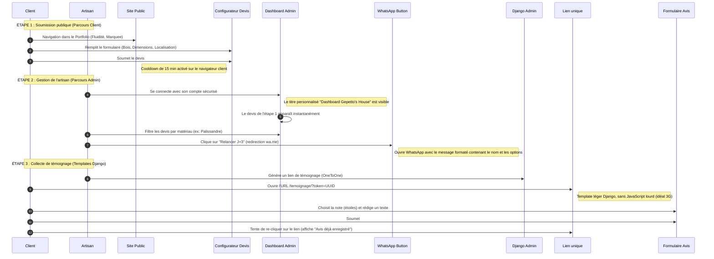

# 🪵 Guide de Soutenance — Geppetto's House

Ce guide a été rédigé spécifiquement pour **Thomas H. (rôle : Backend & Données)** pour préparer la soutenance du projet *Geppetto's House*. Il détaille votre discours diapositive par diapositive, le déroulement de la démonstration en direct, et les points techniques clés pour impressionner le jury.

---

## 🎙️ Partie 1 : Discours de Thomas (Slide par Slide)

### 📊 Slide 7 : Modélisation des Données (Analyse Fonctionnelle)
**Ce que vous devez dire :**
> *"Pour ce projet, j'ai conçu un modèle conceptuel de données (MCD) structuré autour de 4 entités clés afin de garantir l'intégrité métier et la flexibilité du système.*
> 
> *1. **Client_Prospect** : Le point central. Pour simplifier l'expérience, nous n'avons pas de système de compte client complexe. Le numéro de téléphone WhatsApp fait office de clé d'unicité métier.*
> *2. **Devis** : Représente la configuration de la demande. Il est lié à un client et contient les détails du meuble, de la localisation, ainsi que le texte WhatsApp pré-rempli généré à la volée.*
> *3. **Chantier** : Représente le projet réel une fois le devis signé. Il est lié à ses photos via l'entité **ImageChantier**.*
> *4. **Témoignage** : Permet de recueillir l'avis du client. Nous avons défini une règle d'intégrité forte : une relation de type "OneToOne" stricte entre un Chantier et un Témoignage. Un chantier ne peut recevoir qu'un seul avis, et chaque avis est lié à un unique chantier, évitant ainsi les faux avis ou les doublons."*

---

### 🔌 Slide 8 : Architecture Découplée (Avec Jason)
**Ce que vous devez dire :**
> *"Le choix d'une architecture découplée (client-serveur) a été structurant. Côté Backend, j'ai implémenté une API REST robuste avec **Django REST Framework (DRF)**. Cette API expose des endpoints au format JSON.*
> 
> *Le découplage nous a permis de travailler efficacement en parallèle : pendant que je mettais en place les modèles et les validateurs côté Backend, l'équipe Frontend a pu avancer de manière autonome en simulant les réponses de l'API à l'aide de données fictives (mocks) intégrées dans le hook `useQuotes.js`. Une fois nos deux parties prêtes, la connexion s'est faite naturellement et rapidement grâce aux spécifications d'API claires."*

---

### 🔒 Slide 10 : Sécurité Applicative (Avec Arnaud)
**Ce que vous devez dire :**
> *"La sécurité de l'espace de gestion de l'artisan a été une priorité absolue. Nous avons mis en place plusieurs niveaux de protection :*
> 
> *1. **Authentification par Token DRF** : L'artisan s'authentifie pour obtenir un jeton éphémère stocké de manière sécurisée côté Frontend. Les sessions traditionnelles par cookies ont été désactivées pour les appels d'API afin d'éviter les attaques CSRF.*
> *2. **Permissions Django sur-mesure** : J'ai écrit des classes de permissions personnalisées (visibles dans `permissions.py`). L'API publique reste ouverte à tous uniquement pour la création de devis (`POST`), mais bloque immédiatement tout utilisateur non-administrateur qui tente de lister ou modifier les données (`GET`, `PATCH`, `DELETE`).*
> *3. **Protection réseau** : Configuration stricte de la variable `ALLOWED_HOSTS` et de la whitelist CORS pour n'accepter que les requêtes provenant de notre nom de domaine de production, éliminant ainsi les tentatives de requêtes suspectes."*

---

### 💾 Slide 11 : DevOps & Intégrité des Données (Avec Arnaud)
**Ce que vous devez dire :**
> *"Pour assurer la fiabilité de l'application sur le terrain à Madagascar, j'ai mis en place deux mécanismes DevOps fondamentaux :*
> 
> *1. **Transactions atomiques SQL (`transaction.atomic()`)** : Lors de la soumission d'un devis public, l'application doit à la fois créer/mettre à jour le profil du client et enregistrer sa demande de devis. Pour éviter d'avoir des profils clients orphelins en cas de coupure de connexion ou d'erreur d'écriture à mi-chemin, l'ensemble de l'opération est enveloppé dans un bloc transactionnel SQL. Soit tout est écrit en base, soit tout est annulé.*
> *2. **Sauvegardes et disponibilité** : J'ai créé un script `backup.sh` universel qui détecte le moteur de base de données configuré (PostgreSQL en prod, SQLite en dev) et réalise un instantané compressé. Il inclut un mécanisme de rotation automatique sur 7 jours pour ne jamais saturer le stockage.*
> *3. **Optimisation mobile (Pillow)** : Afin de ménager la bande passante 3G des clients, j'ai configuré une compression automatique des photos de chantiers téléversées via Pillow (JPEG, qualité 70%, max 1200px), réduisant le poids moyen des fichiers de 5 Mo à moins de 300 Ko."*

---

### 📈 Slide 13 : Bilan et Perspectives
**Ce que vous devez dire :**
> *"Ce projet nous a permis de valider la conteneurisation complète avec Docker et la gestion du cycle de vie d'une application découplée.*
> *Dans les perspectives d'ouverture, nous prévoyons :*
> *1. De resserrer encore la sécurité en masquant les routes d'administration non connectées côté React pour masquer la surface d'attaque.*
> *2. De restreindre strictement les origines CORS en production via les variables d'environnement sécurisées pour bloquer tout domaine tiers."*

---

## 🖥️ Partie 2 : Scénario de la Démonstration (Démo)

Pour que la démo soit fluide, préparez votre navigateur avec deux onglets ouverts : l'un sur le **site public client (React)**, et l'autre sur l'**espace d'administration (Django Admin / Dashboard)**.

### 💡 Conseils pour la démo (Thomas) :
- **Montrez la compression Pillow** : Pendant que vous montrez le Django Admin, ouvrez la fiche d'un chantier, téléversez une image lourde (ex: 5 Mo) dans `ImageChantier`. Enregistrez, puis montrez au jury que sur le serveur, l'image a été renommée en `.jpg` et compressée (très léger en Mo). C'est une excellente démonstration de votre "axe professionnel/contrainte 3G".
- **Insistez sur la fluidité du wa.me** : Montrez que le message WhatsApp généré reprend fidèlement les caractéristiques du meuble choisi dans le devis.

---

## 🧠 Partie 3 : Réponses aux Questions Difficiles (FAQ Annexes)

Le jury adore poser des questions d'architecture sur les annexes de la soutenance. Voici vos fiches de réponses :

### 1. "Pourquoi avoir désactivé SessionAuthentication dans DRF ?" (Annexe 1 - CORS & Sécurité)
> **Réponse :** *"Si nous gardons la SessionAuthentication active en parallèle de la TokenAuthentication, le navigateur enverra automatiquement les cookies de session de l'admin Django lors des requêtes de la SPA React. DRF détecte ces cookies et applique obligatoirement la vérification CSRF. Hors, la SPA React étant sur un port/domaine différent en dev, elle n'a pas accès au jeton CSRF, ce qui provoque des erreurs 403 systématiques et incompréhensibles pour un utilisateur connecté à l'admin. En désactivant SessionAuthentication pour l'API, nous forçons l'utilisation exclusive du Token DRF, éliminant les conflits CSRF tout en conservant une sécurité optimale."*

### 2. "Que se passe-t-il si deux formulaires de devis sont envoyés en même temps avec le même numéro ?" (Annexe 2 - get_or_create)
> **Réponse :** *"Nous utilisons `Client_Prospect.objects.get_or_create()` basé sur le champ unique `telephone_whatsapp`. Si le client existe déjà, l'ORM le récupère simplement sans créer de doublon en base de données. L'écriture est protégée par un index d'unicité en base de données pour éviter les écritures concurrentes (Race Conditions)."*

### 3. "Comment assurez-vous la sécurité de la base de données avec Docker ?" (Annexe 4 - Isolation Docker)
> **Réponse :** *"En production, le port 5432 de PostgreSQL n'est pas publié vers l'extérieur (pas de bloc `ports:` dans `docker-compose.prod.yml` pour le service db). Seul le conteneur `web` (Django), qui partage le même réseau virtuel privé Docker, peut communiquer avec la base de données. De plus, le mot de passe est injecté de manière dynamique via les variables d'environnement (`.env`), évitant toute fuite d'identifiants dans le dépôt Git."*

### 4. "Pourquoi utiliser la sérialisation imbriquée (Nested Serializers) ?" (Annexe 7)
> **Réponse :** *"Pour optimiser les performances de la vitrine, nous utilisons deux sérialiseurs pour les chantiers : `ChantierListSerializer` (très léger, qui utilise un `SerializerMethodField` pour renvoyer uniquement l'URL de l'image principale) pour l'affichage de la grille de chantiers, et `ChantierDetailSerializer` qui intègre `ImageChantierSerializer(many=True, read_only=True)` pour charger toutes les photos du carrousel uniquement quand l'utilisateur clique sur un chantier spécifique."*
