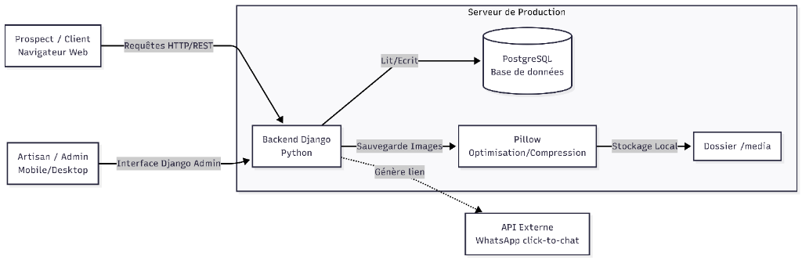
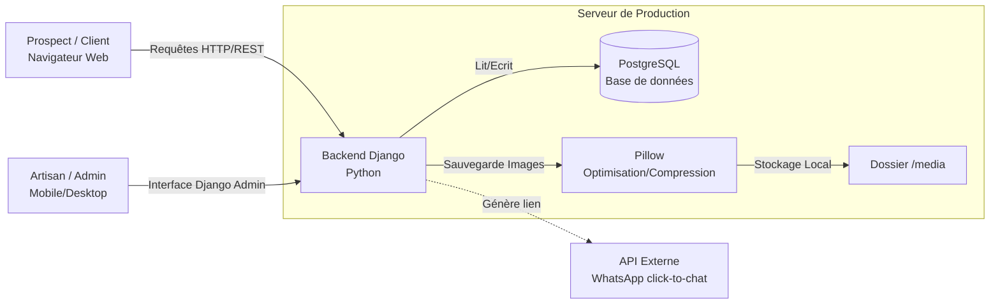
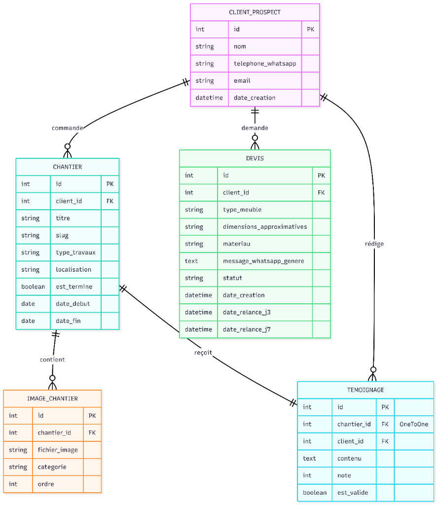
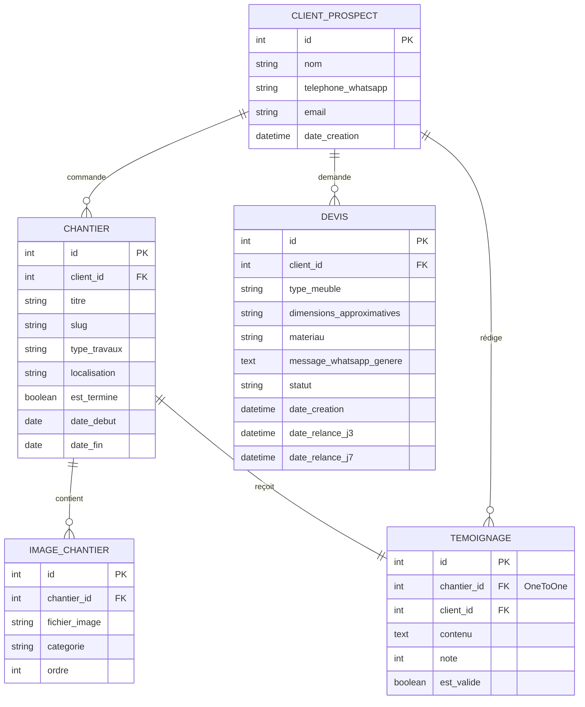
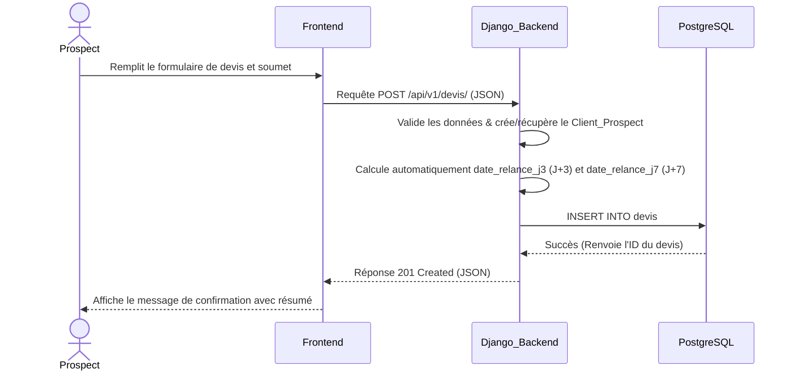
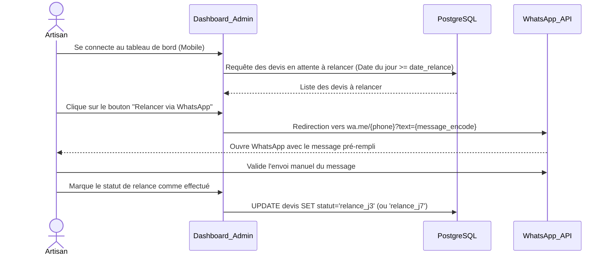

# Gepetto's House - Documentation Technique (Version Finale)

Ce document présente les spécifications techniques de la version MVP (Minimum Viable Product) de la plateforme **Gepetto's House**, un site web dynamique et un tableau de bord de gestion pour un artisan menuisier/charpentier basé à Madagascar.

---

## 0. Histoires d'Utilisateurs (User Stories) et Maquettes

### Histoires d'Utilisateurs (Priorisation MoSCoW)

L'architecture du MVP s'articule autour des besoins utilisateurs suivants, classés selon la méthode MoSCoW :

#### Must Have (Indispensable)
*   **En tant que prospect**, je veux soumettre une demande de devis en ligne en spécifiant mes besoins de mobilier, afin d'obtenir une estimation personnalisée.
*   **En tant qu'artisan (Admin)**, je veux visualiser l'ensemble des demandes de devis entrantes sur un tableau de bord sécurisé, afin de gérer mon portefeuille clients efficacement.
*   **En tant qu'artisan (Admin)**, je veux pouvoir contacter un prospect directement via un bouton WhatsApp "Click-to-Chat", afin de communiquer instantanément sans avoir à enregistrer manuellement son numéro dans mes contacts.

#### Should Have (Important)
*   **En tant que visiteur**, je veux parcourir une galerie de chantiers réalisés (avec photos avant/après et détails des matériaux), afin d'évaluer le savoir-faire et l'expertise de l'artisan.
*   **En tant que visiteur**, je veux consulter des témoignages clients validés, afin de renforcer ma confiance dans les services de l'artisan.

#### Could Have (Optionnel)
*   **En tant que client**, je veux pouvoir soumettre un témoignage de satisfaction après la livraison de mon projet à l'aide d'un lien sécurisé à usage unique (token), afin de simplifier le recueil d'avis.

#### Won't Have (Hors de portée pour la V1)
*   **En tant que client**, je veux payer mes commandes en ligne (exclu de la V1 en raison des limitations des passerelles de paiement locales à Madagascar).

### Maquettes et UX (Design Mobile-First)

L'interface de l'artisan est conçue avec une approche **Mobile-First**. Les chantiers et la gestion des devis s'effectuent sur le terrain (souvent depuis un smartphone). L'interface publique de démonstration de projets et les formulaires de devis sont quant à eux optimisés pour des connexions bas débit (3G). Les maquettes détaillées de l'interface utilisateur, conçues sous Figma par l'équipe front-end (Arnaud), sont disponibles dans le dossier des spécifications UI.

---

## 1. Architecture Système et Flux de Données

Le système est conçu sur un modèle Client-Serveur traditionnel utilisant le framework Django, optimisé pour les contraintes de bande passante de Madagascar.

*   **Front-end** : Pages générées côté serveur via des gabarits Django (Django Templates), associées à une architecture CSS compilée via SASS.
*   **Back-end** : Python avec le framework Django pour la logique métier, la gestion des sessions d'authentification et l'interface d'administration.
*   **Base de Données** : PostgreSQL pour un stockage relationnel persistant, fiable et évolutif.
*   **Gestion des Médias** : Utilisation de la bibliothèque Pillow pour compresser automatiquement les images téléchargées par l'artisan.
*   **API Externe** : WhatsApp Click-to-Chat pour la messagerie instantanée, évitant les surcoûts d'intégration d'API payantes tierces.

### Schéma d'Architecture Système





---

## 2. Conception des Composants, Classes et Base de Données

### Modèles de Données Django (Classes Back-end)

Le système comporte 5 entités principales représentées par des modèles Django :

1.  **`Client_Prospect`** : Représente un client ou un prospect potentiel.
    *   `id` (AutoField) : Clé primaire.
    *   `nom` (CharField, max_length=150) : Nom complet du client.
    *   `telephone_whatsapp` (CharField, max_length=20) : Numéro de téléphone au format international.
    *   `email` (EmailField, blank=True) : Adresse email facultative.
    *   `date_creation` (DateTimeField, auto_now_add=True) : Date d'enregistrement dans le système.

2.  **`Chantier`** : Représente un projet de menuiserie ou charpenterie réalisé.
    *   `id` (AutoField) : Clé primaire.
    *   `client_id` (ForeignKey vers `Client_Prospect`, null=True, blank=True) : Client associé au projet.
    *   `titre` (CharField, max_length=200) : Nom/Titre du projet.
    *   `slug` (SlugField, unique=True) : Identifiant textuel pour des URL propres.
    *   `type_travaux` (CharField, max_length=100) : Ex: Charpente, Mobilier de cuisine.
    *   `localisation` (CharField, max_length=150) : Emplacement du chantier (ex: Antananarivo).
    *   `est_termine` (BooleanField, default=False) : Statut d'avancement.
    *   `date_debut` (DateField) : Date de lancement des travaux.
    *   `date_fin` (DateField, null=True, blank=True) : Date de livraison.

3.  **`ImageChantier`** : Représente les photographies illustrant un chantier.
    *   `id` (AutoField) : Clé primaire.
    *   `chantier_id` (ForeignKey vers `Chantier`, on_delete=CASCADE) : Chantier lié.
    *   `fichier_image` (ImageField) : Fichier de l'image (compressé automatiquement à l'enregistrement).
    *   `categorie` (CharField, max_length=10) : Catégorie d'affichage (`avant`, `pendant`, `apres`).
    *   `ordre` (PositiveIntegerField, default=0) : Ordre d'affichage dans le carrousel.

4.  **`Devis`** : Représente une demande de devis.
    *   `id` (AutoField) : Clé primaire.
    *   `client_id` (ForeignKey vers `Client_Prospect`, on_delete=CASCADE) : Demandeur.
    *   `type_meuble` (CharField, max_length=100) : Nature du meuble (ex: Lit, Table).
    *   `dimensions_approximatives` (CharField, max_length=100) : Dimensions souhaitées.
    *   `materiau` (CharField, max_length=100) : Essence de bois ou matériau demandé (ex: Palissandre).
    *   `message_whatsapp_genere` (TextField) : Contenu pré-rempli pour le lien WhatsApp.
    *   `statut` (CharField, max_length=20, default='en_attente') : Statut du devis (`en_attente`, `relance_j3`, `relance_j7`, `converti`, `abandonne`).
    *   `date_creation` (DateTimeField, auto_now_add=True) : Date de soumission.
    *   `date_relance_j3` (DateTimeField) : Date de relance programmée à J+3.
    *   `date_relance_j7` (DateTimeField) : Date de relance programmée à J+7.

5.  **`Temoignage`** : Retour d'expérience d'un client.
    *   `id` (AutoField) : Clé primaire.
    *   `chantier_id` (OneToOneField vers `Chantier`, on_delete=SET_NULL, null=True) : Projet associé.
    *   `client_id` (ForeignKey vers `Client_Prospect`, on_delete=CASCADE) : Auteur.
    *   `contenu` (TextField) : Texte du témoignage.
    *   `note` (PositiveIntegerField) : Note sur 5 étoiles (1 à 5).
    *   `est_valide` (BooleanField, default=False) : Modéré et approuvé par l'artisan avant publication.

### Schéma Entité-Association (ERD) de la Base de Données

Le schéma ci-dessous détaille la structure relationnelle validée :





---

## 3. Diagrammes de Séquence Systèmes

Les deux cas d'utilisation critiques identifiés dans le cadre du MVP sont modélisés ci-dessous :

### Cas d'utilisation 1 : Soumission d'une nouvelle demande de devis



### Cas d'utilisation 2 : Relance d'un devis en attente par l'artisan (Dashboard Mobile)

Le système de relance du MVP utilise une approche **hybride assistée par l'artisan** pour éliminer les coûts d'intégration des API automatiques WhatsApp Business.



---

## 4. Spécifications des API Externes et Internes

### API Externes

Le projet s'interface avec un seul service externe :

*   **API WhatsApp Click-to-Chat (`https://wa.me/`)** :
    *   **Justification technique** : Contrairement aux solutions lourdes et payantes (Twilio, API Cloud Meta), cette méthode de redirection profonde (deep-linking) est gratuite. Elle génère une URL standard encodant le numéro et le message pré-rempli. L'artisan clique dessus pour envoyer directement le message à partir de son application WhatsApp locale, sans devoir ajouter manuellement le numéro du client dans son répertoire téléphonique. Cela convient parfaitement au contexte malgache où WhatsApp est l'application reine.

### API Internes

Le serveur expose des routes REST internes pour le bon fonctionnement des formulaires dynamiques.

#### Route : Création d'une demande de devis (Devis)
*   **Chemin d'accès** : `/api/v1/devis/`
*   **Méthode HTTP** : `POST`
*   **Format de la Requête (JSON)** :
    ```json
    {
      "client": {
        "nom": "Jean Rakoto",
        "telephone_whatsapp": "+261340000000",
        "email": "jean.rakoto@gmail.com"
      },
      "type_meuble": "Table à manger 8 places",
      "dimensions_approximatives": "220cm x 100cm x 75cm",
      "materiau": "Palissandre"
    }
    ```
*   **Format de la Réponse positive (JSON - Code HTTP `201 Created`)** :
    ```json
    {
      "status": "success",
      "message": "La demande de devis a été enregistrée avec succès.",
      "devis_id": 42
    }
    ```
*   **Format de la Réponse d'erreur (JSON - Code HTTP `400 Bad Request`)** :
    ```json
    {
      "status": "error",
      "errors": {
        "client": {
          "telephone_whatsapp": ["Ce champ est requis."]
        },
        "type_meuble": ["Ce champ ne peut pas être vide."]
      }
    }
    ```

---

## 5. Stratégies de SCM et d'Assurance Qualité (QA)

### Stratégie de SCM (Source Control Management)

*   **Outil** : Git et hébergement des dépôts sur GitHub.
*   **Stratégie de Branches (Git Flow simplifié)** :
    *   `main` : Représente la branche de production. Elle doit toujours contenir un code stable et testé. Les commits directs sur `main` sont interdits.
    *   `backendthomas` : Branche de fonctionnalités dédiée à la configuration de la base de données, à l'authentification sécurisée, aux modèles de données complexes et aux scripts système.
    *   `jason` : Branche de fonctionnalités dédiée aux modèles de gabarits (views.py, templates HTML), à l'intégration SASS (architecture CSS d'Arnaud) et au configurateur de devis.
*   **Processus d'intégration** :
    Chaque développeur effectue ses développements sur sa branche dédiée. Avant de fusionner le code sur `main`, une demande de tirage (Pull Request) est créée, nécessitant la validation de l'autre membre de l'équipe pour éviter les régressions et les conflits de migrations de base de données.

### Stratégie d'Assurance Qualité (QA)

Pour garantir la stabilité de l'application face au rythme soutenu de livraison du MVP :

1.  **Tests Unitaires Automatisés** :
    *   Utilisation du framework de test intégré de Django (`django.test.TestCase`).
    *   Les cas de tests couvriront : la validation des formulaires de devis, les calculs de dates de relance automatique (`date_relance_j3` et `date_relance_j7`), et les droits d'accès au Dashboard artisan (vérification de la sécurité de l'authentification de Thomas).
2.  **Tests Manuels en Environnement de Recette (Staging)** :
    *   **Compression Pillow** : Tester l'envoi d'images lourdes (5 Mo+) depuis le tableau de bord et vérifier que le fichier compressé sur le serveur ne dépasse pas 300 Ko afin de préserver le forfait data 3G des clients.
    *   **Lien Click-to-Chat WhatsApp** : Vérification sur smartphone que le bouton de relance ouvre correctement l'application WhatsApp avec le message encodé.

---

## 6. Choix Technologiques et Roadmap Réduite

### Justifications Techniques

*   **Framework Django (Python)** :
    *   *Avantage* : Son approche "piles incluses" fournit immédiatement un système d'authentification robuste (Thomas) et un espace d'administration performant. Cela permet de répondre à l'histoire utilisateur de l'artisan sans coder un tableau de bord complet à partir de zéro, économisant ainsi de précieuses semaines.
*   **Base de Données PostgreSQL** :
    *   *Avantage* : Beaucoup plus adapté que SQLite en production pour la gestion robuste des relations (clés étrangères strictes) et des accès simultanés, indispensables au traitement des devis et chantiers de l'artisan.
*   **Pillow (Optimisation mobile)** :
    *   *Avantage* : La compression automatique des images stockées localement garantit que le portfolio reste léger et rapide à charger, même sur les connexions mobiles lentes et coûteuses de Madagascar.
*   **WhatsApp wa.me (Click-to-chat)** :
    *   *Avantage* : Permet de concevoir un système de relance opérationnel immédiat pour un coût nul. L'artisan reste décisionnaire de l'envoi (système hybride) et la complexité de l'API de Meta (WhatsApp Business) est évitée.

### Roadmap Accélérée (3 Sprints de 2 semaines)

Pour respecter la deadline réduite de **8 à 6 semaines**, la roadmap s'articule comme suit :

*   **Sprint 1 (Semaines 1-2) — Setup & Base de données** :
    *   Configuration des environnements de développement et déploiement PostgreSQL (Thomas).
    *   Création des structures SASS et mise en place du CRUD de gestion du portfolio (Jason).
*   **Sprint 2 (Semaines 3-4) — Devis & Témoignages** :
    *   Implémentation du configurateur de devis avec calcul automatique des relances J+3/J+7 (Jason).
    *   Mise en œuvre du stockage des médias, authentification de l'artisan et modération des témoignages (Thomas).
*   **Sprint 3 (Semaines 5-6) — Dashboard Artisan Mobile & Déploiement** :
    *   Finalisation de l'interface responsive mobile du dashboard et intégration des boutons Click-to-Chat WhatsApp (Jason).
    *   Vérification finale (QA, compression Pillow) et déploiement du serveur de production (Thomas).
